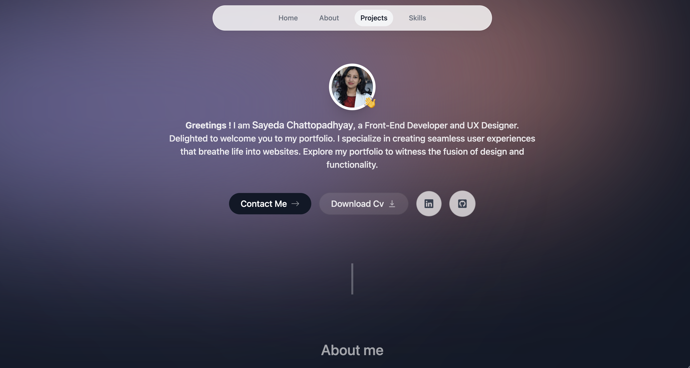

# Portfolio

## Table Of Content

- [About](#about)
- [Functionalities](#functionalities)
- [Tools](#tools)
- [Contributing](#contributing)
- [Developer Bio](#bio)
- [Contact](#contact)

## About

This a portfolio website created as a final assignment for the front end development course at Noroff. This personal portfolio contains 3 projects as responsive cards with link to the github repositries and live demo in netlify.

## Functionalities

The webpage will have the following features :

- 3 projects can be viewed as cards
- there is link to accessthe Github repositories of each of the projects
- there is link to the hosted websites 
- my CV can be viewed / downloaded
- I can be contact via email

## Tools

- React
- Tailwind
- JavaScript
- GitHub
- Vscode
- Netlify
- Figma

 

## Contributing

Contact if you face any issues and if you want to suggest improvements and changes.

## Bio

- UX designer and a front-end developer
- BSc in Physical Sciences
- Several years of experience in banking

<a href="https://endearing-froyo-04825b.netlify.app/">My Portfolio</a>

## Contact

 
