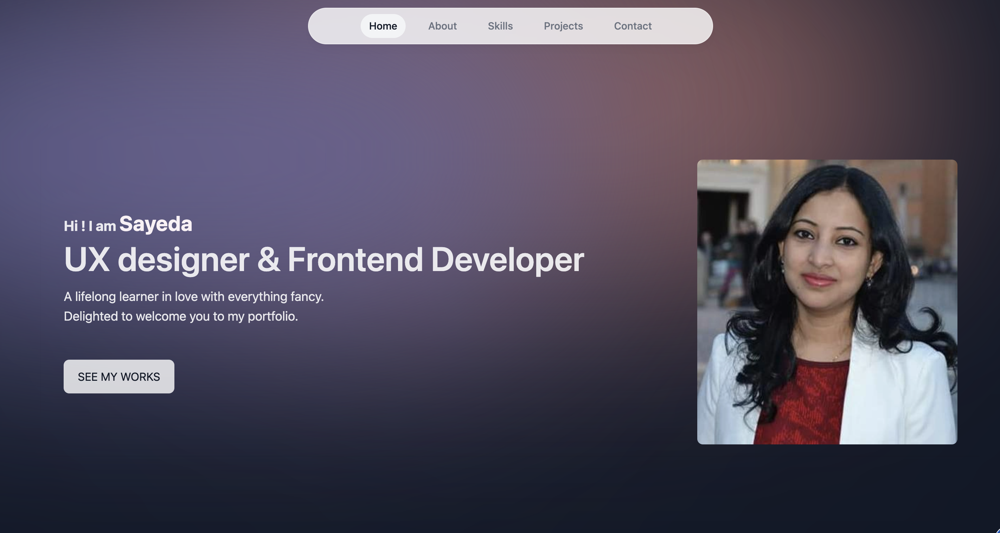

# Portfolio

## Table Of Content

- [About](#about)
- [Functionalities](#functionalities)
- [Tools](#tools)
- [Contributing](#contributing)
- [Developer Bio](#bio)
- [Contact](#contact)

## About

This serves as my personal portfolio, showcasing three projects from a collection I've developed throughout my Front-end development studies. Each project includes links to its respective GitHub repository and a live demo hosted on Netlify.

## Functionalities

The webpage will have the following features :

- Display of three projects presented as cards.
- Links to access the GitHub repositories for each project.
- Links to visit the hosted websites of the projects.
- View/download option for my CV.
- Contact me via email.

## Tools

-next.js
- React
- Tailwind CSS
- JavaScript
- GitHub
- Vscode
- Netlify
- Figma

 

## Contributing

Contact if you face any issues and if you want to suggest improvements and changes.

## Bio

- UX designer and a front-end developer
- BSc in Physical Sciences
- Several years of experience in banking

<a href="https://endearing-froyo-04825b.netlify.app/">My Portfolio</a>

## Contact

 
